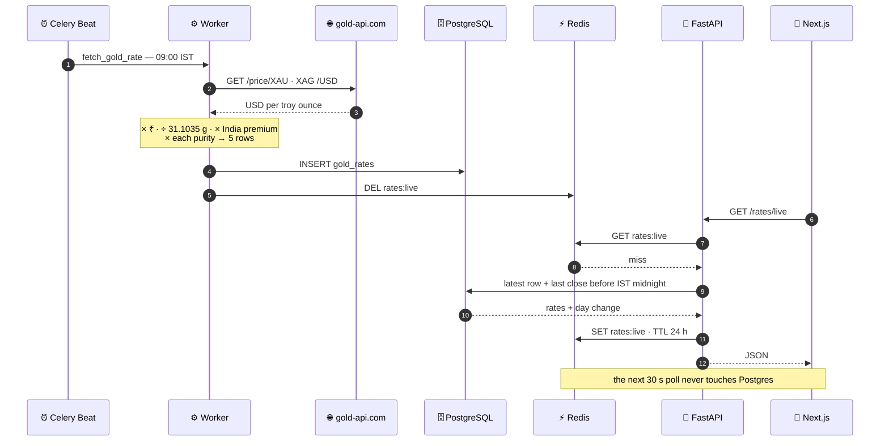

<div align="center">

# ✦ &nbsp;TIRUPATI JEWELLES&nbsp; ✦

<sub>**L I V E** &nbsp;·&nbsp; **G O L D** &nbsp;·&nbsp; **&** &nbsp;·&nbsp; **S I L V E R** &nbsp;·&nbsp; **R A T E S**</sub>

A single-screen storefront for a jewellery shop — today's hallmark rates,
computed from the international spot price, refreshed every morning, cached in Redis.

<br>


[](https://github.com/surajkr97/tirupati-jewelles/actions/workflows/tests.yml)

**[tirupatijewelles.com](https://www.tirupatijewelles.com)** &nbsp;•&nbsp; [Issues](https://github.com/surajkr97/tirupati-jewelles/issues)

</div>

<!--
  Screenshots: drop images in docs/screenshots/ and uncomment.

  <table>
  <tr>
    <td width="33%"></td>
    <td width="33%"></td>
    <td width="33%"></td>
  </tr>
  </table>
-->

---

## The idea

Walk into any jeweller in India and the first question is *"aaj ka rate kya hai?"* — today's rate.
Shops answer it with a whiteboard. This answers it with a phone.

The storefront is deliberately one screen, built at **`max-w-md`** because every real visitor
arrives from a WhatsApp status or an Instagram bio link. It shows a rotating banner, a live
gold-and-silver card with the day's movement, a 24-hour silver sparkline, category tiles, and
one tap each to **call**, **WhatsApp**, or **open the shop in Google Maps**.

Behind it sits a small but complete backend: a Celery beat schedule that pulls the international
spot price each morning, a pricing pipeline that turns it into Indian retail rates per purity,
Postgres for history, and Redis in front of the read path.

---

## How a rate reaches the screen



---

## The pricing pipeline

The API upstream quotes one number: **pure metal, US dollars, per troy ounce.** Everything a
customer actually sees is derived from it.

| Step | Transform | Value |
| :--- | :--- | :--- |
| **1** &nbsp; Spot | `gold-api.com` → `XAU` / `XAG` in USD/oz | live |
| **2** &nbsp; Currency | × USD→INR | `95.75` |
| **3** &nbsp; Weight | ÷ grams per troy ounce | `31.1034768` |
| **4** &nbsp; India premium | × retail markup over international spot | gold `1.15` · silver `1.22` |
| **5** &nbsp; Purity | × karat fraction | see below |
| **6** &nbsp; Display unit | × how the shop quotes it | gold **per 10 g** · silver **per kg** |

<table>
<tr><th align="left">Stored purity</th><th align="left">Sold as</th><th align="left">Fraction</th></tr>
<tr><td><code>999</code></td><td>24 Karat</td><td>0.999</td></tr>
<tr><td><code>916</code></td><td>22 Karat — the bread-and-butter</td><td>0.916</td></tr>
<tr><td><code>750</code></td><td>18 Karat</td><td>0.750</td></tr>
<tr><td><code>585</code></td><td>14 Karat</td><td>0.585</td></tr>
<tr><td><code>999</code> silver</td><td>Fine silver</td><td>0.999</td></tr>
</table>

**Day change** isn't the delta since the last fetch — it's the latest rate minus the last rate
recorded *before midnight IST*, so the green ▲ / red ▼ on the card means the same thing a
customer means by "up today".

> [!NOTE]
> `USD_TO_INR` is currently a constant in [gold_api_adapter.py](server/app/adapters/gold_api_adapter.py).
> Wiring it to a live FX feed is the next obvious upgrade.

---

## What's running

<table>
<tr>
<td width="50%" valign="top">

### 📱 &nbsp;Storefront

**Next.js 16** · App Router · React 19 · TypeScript

- Mobile-first single page, Playfair Display + Inter
- Auto-rotating hero banner (4 s crossfade)
- Live rate card, polled every 30 s
- Hand-rolled SVG sparkline for 24 h silver history
- WhatsApp deep links with pre-written Hindi messages
- Tailwind v4, `lucide-react` + `react-icons`

</td>
<td width="50%" valign="top">

### ⚙️ &nbsp;Rate service

**FastAPI** · SQLAlchemy 2 · Pydantic v2

- `rates:live` cached in Redis for 24 h, busted on refresh
- Celery beat: fetch daily 09:00, prune Mondays 09:00
- 7-day rolling history, composite index on the hot lookup
- Alembic migrations
- Secret-header endpoint for manual refresh
- pytest suite on SQLite + a flushed Redis, green in CI

</td>
</tr>
</table>

---

## API

Base URL `http://localhost:8000` — interactive docs at **`/docs`**.

| | Endpoint | What it returns |
| :--- | :--- | :--- |
| `GET` | **`/rates/live`** | Latest rate per metal × purity, with today's change, display-unit adjusted |
| `GET` | **`/rates/history`** | `?metal=silver&purity=999&hours=24` → time series + `rising` \| `falling` \| `flat` |
| `POST` | **`/rates/internal/refresh`** | Forces a fetch. Requires the `X-Refresh-Key` header |
| `GET` | **`/health`** | `{"status": "ok"}` |

<details>
<summary><b>Sample responses</b></summary>

<br>

**`GET /rates/live`**

```json
[
  {
    "metal": "gold",
    "purity": "916",
    "rate": 118420,
    "change": 340,
    "recorded_at": "2026-08-02T09:00:04+00:00"
  },
  {
    "metal": "silver",
    "purity": "999",
    "rate": 158900,
    "change": -1250,
    "recorded_at": "2026-08-02T09:00:05+00:00"
  }
]
```

`rate` is ₹ per 10 g for gold and ₹ per kg for silver — already rounded for display.

**`GET /rates/history?metal=silver&purity=999&hours=24`**

```json
{
  "metal": "silver",
  "purity": "999",
  "trend": "rising",
  "points": [
    { "rate": 157650.0, "recorded_at": "2026-08-01T09:00:05+00:00" },
    { "rate": 158900.0, "recorded_at": "2026-08-02T09:00:05+00:00" }
  ]
}
```

**`POST /rates/internal/refresh`**

```bash
curl -X POST http://localhost:8000/rates/internal/refresh \
     -H "X-Refresh-Key: $REFRESH_SECRET_KEY"
# → {"status": "ok", "rows_saved": 5}
```

</details>

---

## Run it

### Everything, in one command

```bash
cd server
cp .env.example .env        # then fill in SECRET_KEY and REFRESH_SECRET_KEY
docker compose up --build
```

Compose brings up five containers:

| Container | Role |
| :--- | :--- |
| `tirupati-api` | FastAPI on **:8000** |
| `tirupati-db` | PostgreSQL 16 on **:5432**, volume-backed |
| `tirupati-redis` | Redis 7 on **:6379** — cache *and* Celery broker |
| `tirupati-worker` | Celery worker |
| `tirupati-beat` | Celery beat scheduler (`Asia/Kolkata`) |

Then apply migrations and seed the first set of rates:

```bash
docker compose exec api alembic upgrade head
docker compose exec api python -m app.tasks.fetch_gold_rate
```

### Without Docker

```bash
# backend — needs Python 3.11+, Postgres and Redis running locally
cd server
python -m venv venv && source venv/bin/activate
pip install -r requirements.txt
alembic upgrade head
uvicorn main:app --reload

# celery, in two more terminals
celery -A app.celery_app worker --loglevel=info
celery -A app.celery_app beat   --loglevel=info
```

```bash
# frontend — needs Node 20+
cd frontend
npm install
echo "NEXT_PUBLIC_API_URL=http://localhost:8000" > .env.local
npm run dev
```

Storefront on **http://localhost:3000**.

### Environment

<table>
<tr><th align="left"><code>server/.env</code></th><th>Required</th><th align="left">Notes</th></tr>
<tr><td><code>DATABASE_URL</code></td><td align="center">✅</td><td>Postgres connection string</td></tr>
<tr><td><code>REDIS_URL</code></td><td align="center">✅</td><td>Cache and Celery broker — one instance does both</td></tr>
<tr><td><code>SECRET_KEY</code></td><td align="center">✅</td><td>Signing secret</td></tr>
<tr><td><code>REFRESH_SECRET_KEY</code></td><td align="center">✅</td><td>Guards <code>/rates/internal/refresh</code></td></tr>
<tr><td colspan="3"></td></tr>
<tr><th align="left"><code>frontend/.env.local</code></th><th>Required</th><th align="left">Notes</th></tr>
<tr><td><code>NEXT_PUBLIC_API_URL</code></td><td align="center">✅</td><td>Falls back to <code>http://localhost:8000</code></td></tr>
</table>

---

## Tests

```bash
cd server && pytest          # add --cov=app for coverage
```

The suite runs the real FastAPI app through `TestClient`, swaps Postgres for a throwaway SQLite
file per test, and **flushes Redis before and after every test** — the cache is part of the read
path, so leaving it dirty made tests pass in isolation and fail in sequence. Coverage: the live
endpoint, day-change arithmetic across the IST midnight boundary, history windowing, and trend
detection.

[GitHub Actions](.github/workflows/tests.yml) runs the same suite on every push and PR to
`master`, with a Redis service container alongside.

---

## Layout

```
tirupati-jewelles/
├── server/
│   ├── app/
│   │   ├── adapters/      gold_api_adapter.py — the only thing that talks to the outside
│   │   ├── services/      rate_service.py — pricing math, caching, history, trend
│   │   ├── tasks/         fetch_gold_rate · cleanup_gold_rates
│   │   ├── routes/        rates.py
│   │   ├── models/        SQLAlchemy tables
│   │   ├── schemas/       Pydantic contracts
│   │   ├── core/          settings
│   │   ├── cache.py       Redis client
│   │   └── celery_app.py  broker + beat schedule
│   ├── alembic/versions/  migrations
│   ├── tests/             pytest suite
│   └── docker-compose.yml api · db · redis · worker · beat
│
└── frontend/
    ├── src/app/page.tsx   the storefront
    ├── src/app/layout.tsx fonts + shell
    └── public/            hero banners
```

---

## Deployment

Frontend on **Vercel**, backend containerised from [server/Dockerfile](server/Dockerfile) with
managed Postgres and Redis. CORS is pinned to `localhost:3000`, `tirupati-jewelles.vercel.app`
and `www.tirupatijewelles.com` in [main.py](server/main.py) — add new origins there.

**Next up:** live FX rate instead of the hardcoded USD→INR, per-purity sparklines, a WhatsApp
broadcast when the rate moves past a threshold.

---

<div align="center">
<sub>© Tirupati Jewelles — all rights reserved. Not open source.</sub>
<br><br>
<sub>Built with FastAPI, Celery and a lot of chai ☕</sub>
</div>
